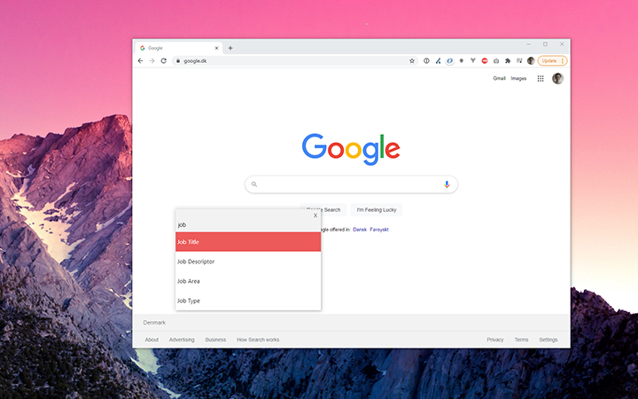
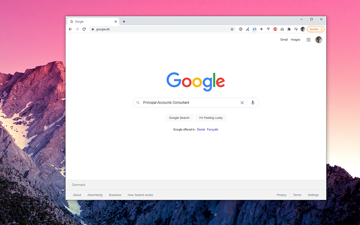

<div align="center">
	
	<h1>Unipen</h1>
	<p>
		<b>🧨 Provides more realistics data with ease 🎉</b>
	</p>	
	<br>
</div>

This is a windows application, that helps to provide more realistics data when proforming your manully test of both web applcations.

🧨 Better test for real user input

🥳 Simple to use for both developers and testers!

## Screenshots




## 👇 Download

Use the following link to download the lastest version.

```
To be announced
```

Requires Windows *

## 📜 How to use

After installing the application make sure it's running in the tray bar. You can then use the application anywere. Simply press "Ctrl+Alt+P":

This will bring up the application can ready to be used. Search for one of the wanted text (You can navigate with the arrow keys). Press enter to choose the selected text label. 

## 🎢 Future plans

- Add support for macOS (Should work but needs testing)
- Add support for language 

## 🆘 Contribute 

Please feel free to upon any PR. Then let's see where the project will become 🔥

Use the following command to run/debug the code from source
```
$ npm install
$ npm run debug
```

To build a local release/test version run the following:
```
$ npm run make
```

## Release of a new version

```
$ npm run dist
```

## Credits

- [Icon](https://elements.envato.com/funky-pencils-SKCGVT)

